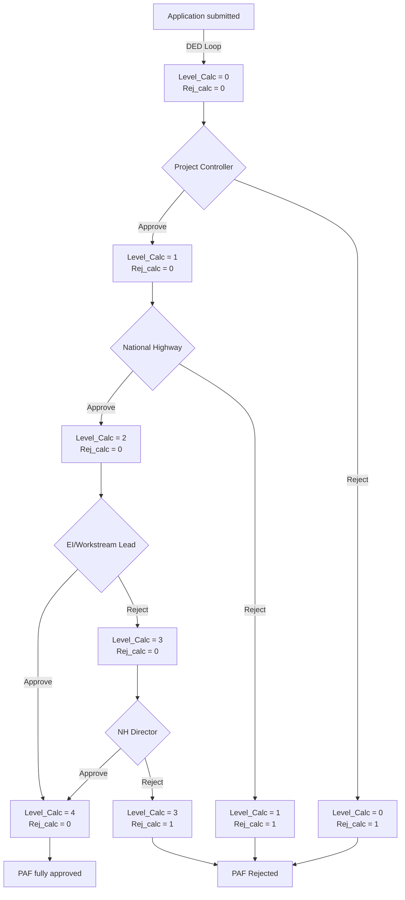

# SMPA
SMP Portal Aplication

## Flowchart

```mermaid
flowchart TD
    A[Application submitted] --> |DED Loop|B[Level_Calc = 0 \nRej_calc = 0]
    
    B --> PC{Project Controller}
    PC -->|Approve| PCA[Level_Calc = 1 \nRej_calc = 0]
    PC -->|Reject| PCR[Level_Calc = 0 \nRej_calc = 1]
    
    PCA -->NH{National Highway}
    NH -->|Approve| NHA[Level_Calc = 2 \nRej_calc = 0]
    NH -->|Reject| NHR[Level_Calc = 1 \nRej_calc = 1]

    NHA --> EI{EI/Workstream Lead}
    EI -->|Approve| EIA[Level_Calc = 4 \nRej_calc = 0]
    EI -->|Reject| EIR[Level_Calc = 3 \nRej_calc = 0]
    
    EIR --> DIR{NH Director}
    DIR -->|Approve| EIA
    DIR -->|Reject| DIRR[Level_Calc = 3 \nRej_calc = 1] 

    EIA --> APR[PAF fully approved]    

    PCR --> REJ[PAF Rejected]
    NHR --> REJ
    DIRR -->REJ;
```
