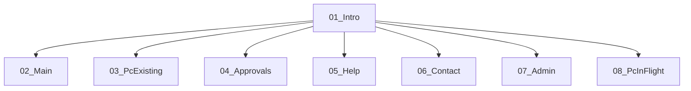
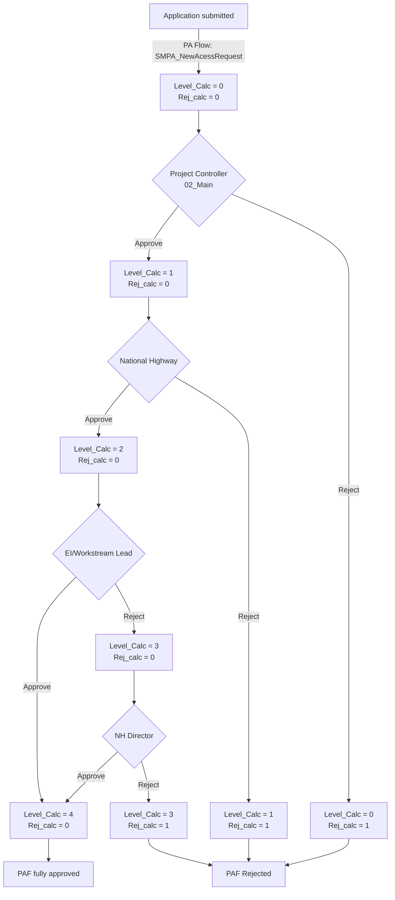

# SMPA Portal Application 

This is repo with documentation for SMPA Portal Appliation.

## App details 

The app frontend is build in MS PowerApps. Data is stored in MS SQL Server DB. 
Backgound operations are run using PowerAutomate Flows. The app  is hosted in Highways England M365 Environment.

The main scope of the application is to automate the process of approving employess assigned to work in SMP Project.  

## Standards

The app follows standards, such as naming convention and items organisation proposed by microsoft team: https://pahandsonlab.blob.core.windows.net/documents/PowerApps%20canvas%20app%20coding%20standards%20and%20guidelines.pdf

#### Naming convention
| Control name | Abbreviation |
| ------------ | ------------ |
| button | btn |
| camera control  | cam |
| canvas | can |
| card | crd |
| collection | col |
| combo box | cmb |
| dates | dte |
| drop down | drp | 
| form | frm |
| gallery | gal |
| group | grp |
| header page shape | hdr |
| html text | htm |
| icon | ico |
| image | img |
| label | lbl |
| page section shape | sec |
| shapes (rectangle, circle, and so on) | shp |
| table data | tbl |
| text input | txt |
| timer | tim |

## App Structure

In the app menu on the [01_Intro](03_AppDoceumentation/01_Intro.md) Screen user can choose between two standard operations, that based on users access, directs them to different screens:
* Approvals:
    - Budgetholders -> [04_Approvals](03_AppDoceumentation/04_Approvals.md)
    - National Highways controlers -> [04_Approvals](03_AppDoceumentation/04_Approvals.md)
    - Managers -> [04_Approvals](03_AppDoceumentation/04_Approvals.md)
    
* Operations:
    - Project Controlers
        - Confirm New PAFs -> [02_Main](03_AppDoceumentation/02_Main.md)
        - Edit Existing PAFs -> [03_PCExisting](03_AppDoceumentation/03_PCExisting.md)
        - In-flight PAF applications - > [08_PcInFlight](03_AppDoceumentation/08_PcInFlight.md)
    - Project Accountants
    - Project Wise team

## App business logic

### Application submission

Employees are applying for approval by submitting MS Forms
- https://forms.office.com/Pages/ResponsePage.aspx?id=1aqQyyceHUCdNGlCVzIC6OZsSsVRHEtEswlfkRsxnU5UQU5SVkdZMjVPWFpERTlROTA1UFhITFJUVi4u

Forms submission triggers the PA SMPA_NewAcessRequest flow, that checks if the person is already in DB. If not, then person is added to DB. In some project pre-approval before adding to DB is required. It is realised using approval email notification. If there is no response from approver for more than 7 days, it is interpreted as approval. 

Each person in DB has an unique id (ID2 column). PAF number is an unique Person-Project identifier. 

### Approval Process

The first stage of process is approval of PAF by Project Controler. PC checks the data and makes any corrections if needed. PC can approve or reject the PAF.

The second stage is the client approval. Client can approve or reject PAF. 

The third stage of approval is Budgetholder. They can either approve PAF or send it for approval to Director/Manager.

Director Manager approval/rejection is required only in case if budgetholder did not approve PAF

